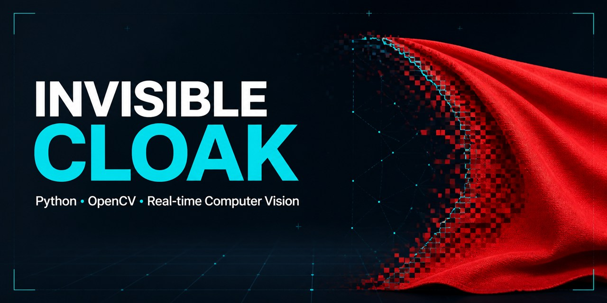

<p align="center">
  
</p>

# Invisible Cloak

[](https://github.com/Elenor274/invisible-cloak/actions/workflows/ci.yml)


A real-time computer-vision experiment inspired by the invisibility cloak from Harry Potter. The application detects a red cloth in a webcam feed and replaces it with a previously captured background.

## How it works

```text
Webcam frame → HSV conversion → red color mask → mask cleanup
             → background replacement → real-time output
```

Red wraps around the edge of the HSV hue range, so the application combines two masks. Morphological operations remove noise, and Gaussian blur softens the replacement boundary.

## Quick start

```bash
git clone https://github.com/Elenor274/invisible-cloak.git
cd invisible-cloak

python -m venv .venv
source .venv/bin/activate  # Windows: .venv\Scripts\activate
pip install -r requirements.txt
python invisibility_cloak.py
```

Move out of view while the background is captured. Then hold up a red cloth and press `Q` when you want to exit.

### Options

```bash
python invisibility_cloak.py \
  --camera 0 \
  --warmup 3 \
  --background-frames 40
```

## Project structure

```text
.
├── invisibility_cloak.py
├── tests/
├── requirements.txt
└── requirements-dev.txt
```

## Tests

The image-processing functions are tested with synthetic frames, so CI does not need access to a webcam.

```bash
pip install -r requirements.txt -r requirements-dev.txt
python -m pytest -q
```

## Limitations

- Best results require a static camera and stable lighting.
- Red objects elsewhere in the scene are hidden as well.
- The background should remain unchanged after capture.

## License

Released under the [MIT License](LICENSE).
